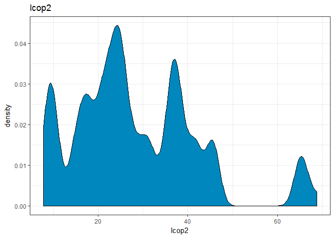
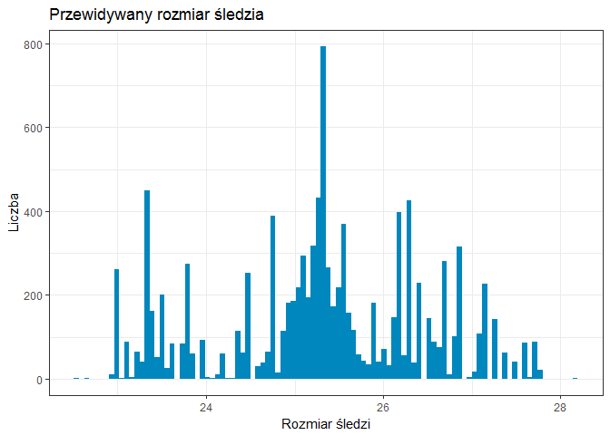
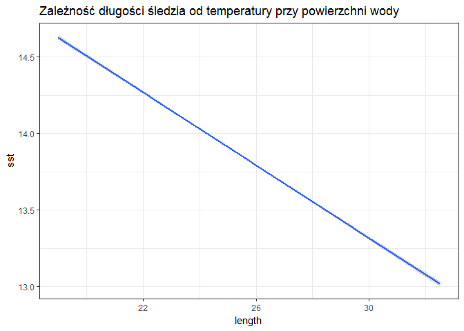

# Zaawansowana Eksploracja Danych - projekt
Tomasz Nowak  
`r format(Sys.Date(), "%d %b, %Y")`  


```r
knitr::opts_chunk$set(cache = TRUE)
data <- read.csv(text=getURL("https://raw.githubusercontent.com/NowakTom/ZED/master/sledzie.csv"), na.strings = "?")
```

# Analiza problemu

Celem projektu jest określenie jakie mogą być główne przyczyny stopniowego zmniejszania się długości śledzi oceanicznych wyławianych w Europie. Zbiór został odpowiednio przygotowany - wartości nieznane zostały usunięte, w ramach przetwarzania regresji i oceny ważności atrybutów opuszczona została zmienna dotycząca liczby porządkowej.

Analiza zbioru wykazała, iż większość paramterów nie posiada rozkładu normalnego. W ramach korelacji można znaleźć silne powiązania pomiędzy zmiennymi (jak np.: powiązanie pomiędzy gatunkami planktonu). 

W ramach określonego regresora przewidywana długość odławianych śledzi będzie w przedziale 24-27cm, co z w stosunku do wartości minimalnej (19cm), mediany (25,5cm) oraz maksymalnej (32,5cm) daje stosunkowo dobry wynik.

Bezpośrednio został zidentyfikowany wpływ temperatury wody na długość odławianych śledzi. W ramach spadku temperatury rośnie długość śledzia - czyt. jeżeli jest niższa temperatura wody, wyławiane ryby są dłuższe niż, gdy temperatura wody jest wyższa. Wpływ na temperaturę wody posiada miesiąc połowu. Na jednym z ostatnich histogramów widać, iż śledzie wyławiane są w ostatnich latach w okolicy środka lipca. W przypadku połowu ryb w okolicach czerwca, temperatura wody jest niższa, a co za tym idzie widać zwiększony rozmiar ryb. Na temperaturę wody wpływ również może mieć Oscylacja Północnoatlantycka, która jest związana z globalną cyrkulacją powietrza i wody oceanicznej. Ujawnia się poprzez przypadkowe wahania takich parametrów, jak ciśnienie, temperatura, prędkość wiatru, ilość opadów

Dane zawierały informacje z okresu 60 lat, w przeciągu którego dynamicznie może zmieniać się klimat, za pośrednictwem, którego wpływa się na temperaturę wody przy powierzchni wody.

# Opis danych

Na przestrzeni ostatnich lat zauważono stopniowy spadek rozmiaru śledzia oceanicznego wyławianego w Europie. Do analizy zebrano pomiary śledzi i warunków w jakich żyją z ostatnich 60 lat. Dane były pobierane z połowów komercyjnych jednostek. W ramach połowu jednej jednostki losowo wybierano od 50 do 100 sztuk trzyletnich śledzi.

 <center>
Nazwa zmiennej | Opis
--------| -------------
length | długość złowionego śledzia [cm]
cfin1 | dostępność planktonu [zagęszczenie Calanus finmarchicus gat. 1]
cfin2 | dostępność planktonu [zagęszczenie Calanus finmarchicus gat. 2]
chel1 | dostępność planktonu [zagęszczenie Calanus helgolandicus gat. 1]
chel2 | dostępność planktonu [zagęszczenie Calanus helgolandicus gat. 2]
lcop1 | dostępność planktonu [zagęszczenie widłonogów gat. 1]
lcop2 | dostępność planktonu [zagęszczenie widłonogów gat. 2]
fbar | natężenie połowów w regionie [ułamek pozostawionego narybku]
recr | roczny narybek [liczba śledzi]
cumf | łączne roczne natężenie połowów w regionie [ułamek pozostawionego narybku]
totaln | łączna liczba ryb złowionych w ramach połowu [liczba śledzi]
sst | temperatura przy powierzchni wody [°C]
sal | poziom zasolenia wody [Knudsen ppt]
xmonth | miesiąc połowu [numer miesiąca]
nao | oscylacja północnoatlantycka [mb] 
</center>

Wiersze w zbiorze są uporządkowane chronologicznie.

# Rozmiar zbioru i podstawowe statystyki

W zbiorze znajduje się 52582 obserwacji rozmieszczonych w 16 kolumnach (kolumna X posiada informacje na temat liczby porządkowej, zostanie użyta później jako chronologiczny punkt odniesienia przy chociażby określeniu zmiany rozmiaru śledzi w czasie).

Wartości puste znajdują się przede wszystkim w kolumnach odpowiedzialnych za informacje odnośnie dostępności planktonu oraz temperatury przy powierzchni wody.

W tabeli znajdują się również informacje odnośnie wartości minimalnych, maksymalnych, średnich oraz medianach dla poszczególnych zmiennych. 


```r
knitr::kable(str(data))
```

```
## 'data.frame':	52582 obs. of  16 variables:
##  $ X     : int  0 1 2 3 4 5 6 7 8 9 ...
##  $ length: num  23 22.5 25 25.5 24 22 24 23.5 22.5 22.5 ...
##  $ cfin1 : num  0.0278 0.0278 0.0278 0.0278 0.0278 ...
##  $ cfin2 : num  0.278 0.278 0.278 0.278 0.278 ...
##  $ chel1 : num  2.47 2.47 2.47 2.47 2.47 ...
##  $ chel2 : num  NA 21.4 21.4 21.4 21.4 ...
##  $ lcop1 : num  2.55 2.55 2.55 2.55 2.55 ...
##  $ lcop2 : num  26.4 26.4 26.4 26.4 26.4 ...
##  $ fbar  : num  0.356 0.356 0.356 0.356 0.356 0.356 0.356 0.356 0.356 0.356 ...
##  $ recr  : int  482831 482831 482831 482831 482831 482831 482831 482831 482831 482831 ...
##  $ cumf  : num  0.306 0.306 0.306 0.306 0.306 ...
##  $ totaln: num  267381 267381 267381 267381 267381 ...
##  $ sst   : num  14.3 14.3 14.3 14.3 14.3 ...
##  $ sal   : num  35.5 35.5 35.5 35.5 35.5 ...
##  $ xmonth: int  7 7 7 7 7 7 7 7 7 7 ...
##  $ nao   : num  2.8 2.8 2.8 2.8 2.8 2.8 2.8 2.8 2.8 2.8 ...
```

```r
knitr::kable(summary(data))
```

           X             length         cfin1             cfin2             chel1            chel2            lcop1              lcop2             fbar             recr              cumf             totaln             sst             sal            xmonth            nao         
---  --------------  -------------  ----------------  ----------------  ---------------  ---------------  -----------------  ---------------  ---------------  ----------------  ----------------  ----------------  --------------  --------------  ---------------  -----------------
     Min.   :    0   Min.   :19.0   Min.   : 0.0000   Min.   : 0.0000   Min.   : 0.000   Min.   : 5.238   Min.   :  0.3074   Min.   : 7.849   Min.   :0.0680   Min.   : 140515   Min.   :0.06833   Min.   : 144137   Min.   :12.77   Min.   :35.40   Min.   : 1.000   Min.   :-4.89000 
     1st Qu.:13145   1st Qu.:24.0   1st Qu.: 0.0000   1st Qu.: 0.2778   1st Qu.: 2.469   1st Qu.:13.427   1st Qu.:  2.5479   1st Qu.:17.808   1st Qu.:0.2270   1st Qu.: 360061   1st Qu.:0.14809   1st Qu.: 306068   1st Qu.:13.60   1st Qu.:35.51   1st Qu.: 5.000   1st Qu.:-1.89000 
     Median :26291   Median :25.5   Median : 0.1111   Median : 0.7012   Median : 5.750   Median :21.673   Median :  7.0000   Median :24.859   Median :0.3320   Median : 421391   Median :0.23191   Median : 539558   Median :13.86   Median :35.51   Median : 8.000   Median : 0.20000 
     Mean   :26291   Mean   :25.3   Mean   : 0.4458   Mean   : 2.0248   Mean   :10.006   Mean   :21.221   Mean   : 12.8108   Mean   :28.419   Mean   :0.3304   Mean   : 520367   Mean   :0.22981   Mean   : 514973   Mean   :13.87   Mean   :35.51   Mean   : 7.258   Mean   :-0.09236 
     3rd Qu.:39436   3rd Qu.:26.5   3rd Qu.: 0.3333   3rd Qu.: 1.7936   3rd Qu.:11.500   3rd Qu.:27.193   3rd Qu.: 21.2315   3rd Qu.:37.232   3rd Qu.:0.4560   3rd Qu.: 724151   3rd Qu.:0.29803   3rd Qu.: 730351   3rd Qu.:14.16   3rd Qu.:35.52   3rd Qu.: 9.000   3rd Qu.: 1.63000 
     Max.   :52581   Max.   :32.5   Max.   :37.6667   Max.   :19.3958   Max.   :75.000   Max.   :57.706   Max.   :115.5833   Max.   :68.736   Max.   :0.8490   Max.   :1565890   Max.   :0.39801   Max.   :1015595   Max.   :14.73   Max.   :35.61   Max.   :12.000   Max.   : 5.08000 
     NA              NA             NA's   :1581      NA's   :1536      NA's   :1555     NA's   :1556     NA's   :1653       NA's   :1591     NA               NA                NA                NA                NA's   :1584    NA              NA               NA               

# Brakujące dane

Brakujące dane w zbiorze podczas zaczytywania pliku zostały zamienione z znaków "?" na "NA". Z racji złożoności zbioru wiersze nie zawierające informacji zostały usunięte, parametry w zbiorze po oczyszczeniu przedstawiały się następująco.


```r
apply(data, 2, function(x) sum(is.na(x)))
```

```
##      X length  cfin1  cfin2  chel1  chel2  lcop1  lcop2   fbar   recr 
##      0      0   1581   1536   1555   1556   1653   1591      0      0 
##   cumf totaln    sst    sal xmonth    nao 
##      0      0   1584      0      0      0
```

```r
data <- na.omit(data)
knitr::kable(summary(data))
```

           X             length         cfin1             cfin2             chel1            chel2            lcop1              lcop2             fbar             recr              cumf             totaln             sst             sal            xmonth            nao         
---  --------------  -------------  ----------------  ----------------  ---------------  ---------------  -----------------  ---------------  ---------------  ----------------  ----------------  ----------------  --------------  --------------  ---------------  -----------------
     Min.   :    1   Min.   :19.0   Min.   : 0.0000   Min.   : 0.0000   Min.   : 0.000   Min.   : 5.238   Min.   :  0.3074   Min.   : 7.849   Min.   :0.0680   Min.   : 140515   Min.   :0.06833   Min.   : 144137   Min.   :12.77   Min.   :35.40   Min.   : 1.000   Min.   :-4.89000 
     1st Qu.:13233   1st Qu.:24.0   1st Qu.: 0.0000   1st Qu.: 0.2778   1st Qu.: 2.469   1st Qu.:13.427   1st Qu.:  2.5479   1st Qu.:17.808   1st Qu.:0.2270   1st Qu.: 360061   1st Qu.:0.14809   1st Qu.: 306068   1st Qu.:13.60   1st Qu.:35.51   1st Qu.: 5.000   1st Qu.:-1.90000 
     Median :26308   Median :25.5   Median : 0.1111   Median : 0.7012   Median : 5.750   Median :21.435   Median :  7.0000   Median :24.859   Median :0.3320   Median : 421391   Median :0.23191   Median : 539558   Median :13.86   Median :35.51   Median : 8.000   Median : 0.20000 
     Mean   :26316   Mean   :25.3   Mean   : 0.4457   Mean   : 2.0269   Mean   :10.016   Mean   :21.197   Mean   : 12.8386   Mean   :28.396   Mean   :0.3306   Mean   : 519877   Mean   :0.22987   Mean   : 515082   Mean   :13.87   Mean   :35.51   Mean   : 7.252   Mean   :-0.09642 
     3rd Qu.:39447   3rd Qu.:26.5   3rd Qu.: 0.3333   3rd Qu.: 1.7936   3rd Qu.:11.500   3rd Qu.:27.193   3rd Qu.: 21.2315   3rd Qu.:37.232   3rd Qu.:0.4650   3rd Qu.: 724151   3rd Qu.:0.29803   3rd Qu.: 730351   3rd Qu.:14.16   3rd Qu.:35.52   3rd Qu.: 9.000   3rd Qu.: 1.63000 
     Max.   :52580   Max.   :32.5   Max.   :37.6667   Max.   :19.3958   Max.   :75.000   Max.   :57.706   Max.   :115.5833   Max.   :68.736   Max.   :0.8490   Max.   :1565890   Max.   :0.39801   Max.   :1015595   Max.   :14.73   Max.   :35.61   Max.   :12.000   Max.   : 5.08000 

# Szczegółowa analiza wartości atrybutów

Zbiór, który w ramach analizy jest przetwarzany, posiada duże ilości rekordów. Zastosowanie tutaj zwykłych wykresów liniowych czy punktowych wyświetla dość spiętrzone wyniki, które są bardzo trudne w analizie. Aby zastosować te metody analizy graficznej atrybutów należałoby odpowiednio dane próbkować. Istnieje również inne możliwe przedstawienie informacji o danych, zastosowanie wykresów gęstości, bądź histogramów, które są w stanie określić liczebność zmiennych w poszczególnych przedziałach. W ramach prezentacji atrybutów tymczasowo w zbiorze pominięty został atrybut oznaczający liczbę porządkową.

<center>

```r
data_geom <- select(data,-X)
for (i in colnames(data_geom)) {print(ggplot(data_geom,aes_string(x = i)) + geom_density(fill = "#0087BD") + ggtitle(i) + theme_bw())
print(ggplot(data_geom,aes_string(x = i)) + geom_histogram(bins = 50,aes(fill = ..count..)) + scale_fill_gradient("Count", low = "yellow", high = "blue") + ggtitle(i) + theme_bw()) }
```

<!-- --><!-- --><!-- --><!-- --><!-- --><!-- --><!-- --><!-- --><!-- --><!-- --><!-- --><!-- --><!-- --><!-- --><!-- --><!-- --><!-- --><!-- --><!-- --><!-- --><!-- --><!-- --><!-- --><!-- --><!-- --><!-- --><!-- --><!-- --><!-- --><!-- -->
</center>

# Wykres prezentujący zmianę rozmiaru śledzi w czasie

Interaktywny wykres, w którym udział biorą dwie zmienne, liczba porządkowa = X oraz długość śledzia = length. Z racji tego, iż zbiór ustawiony jest chronologicznie, liczba porządkowa jest puntkem odniesienia w czasie.

<center>

```r
sledzie_w_czasie<-ggplot(data,aes(X,length)) + geom_smooth() + theme_bw() + ggtitle("Zmiana rozmiaru śledzi w czasie") + labs(x= "Czas",y="Rozmiar śledzi")
ggplotly(sledzie_w_czasie)
```

<!--html_preserve--><div id="htmlwidget-da30f90cf87c4577904d" style="width:672px;height:480px;" class="plotly html-widget"></div>
<script type="application/json" data-for="htmlwidget-da30f90cf87c4577904d">{"x":{"data":[{"x":[1,666.556962025316,1332.11392405063,1997.67088607595,2663.22784810127,3328.78481012658,3994.3417721519,4659.89873417722,5325.45569620253,5991.01265822785,6656.56962025316,7322.12658227848,7987.6835443038,8653.24050632911,9318.79746835443,9984.35443037975,10649.9113924051,11315.4683544304,11981.0253164557,12646.582278481,13312.1392405063,13977.6962025316,14643.253164557,15308.8101265823,15974.3670886076,16639.9240506329,17305.4810126582,17971.0379746835,18636.5949367089,19302.1518987342,19967.7088607595,20633.2658227848,21298.8227848101,21964.3797468354,22629.9367088608,23295.4936708861,23961.0506329114,24626.6075949367,25292.164556962,25957.7215189873,26623.2784810127,27288.835443038,27954.3924050633,28619.9493670886,29285.5063291139,29951.0632911392,30616.6202531646,31282.1772151899,31947.7341772152,32613.2911392405,33278.8481012658,33944.4050632911,34609.9620253165,35275.5189873418,35941.0759493671,36606.6329113924,37272.1898734177,37937.746835443,38603.3037974684,39268.8607594937,39934.417721519,40599.9746835443,41265.5316455696,41931.0886075949,42596.6455696203,43262.2025316456,43927.7594936709,44593.3164556962,45258.8734177215,45924.4303797468,46589.9873417722,47255.5443037975,47921.1012658228,48586.6582278481,49252.2151898734,49917.7721518987,50583.3291139241,51248.8860759494,51914.4430379747,52580],"y":[24.4019532510441,24.5325523161891,24.6620464666224,24.7893307876321,24.9133003645067,25.0328502825342,25.146875627003,25.2542714832013,25.3539329364174,25.4447598650459,25.5266855372574,25.6019573803281,25.673137268706,25.7427870768391,25.8134686791754,25.8877439501628,25.9681747642494,26.0573229958832,26.1577084919278,26.2686309108767,26.3839491964048,26.4969974956325,26.6011099556803,26.6896207236685,26.7558639467177,26.7931737719481,26.7948843464803,26.7547818619542,26.6749275998764,26.5646268460207,26.4334295680843,26.2908857337644,26.1465453107581,26.0099582667627,25.8906745694753,25.7982441865932,25.7407730183256,25.7155644203795,25.7150286813001,25.7315518874136,25.7575201250461,25.7853194805236,25.8073360401722,25.815955890318,25.8035688872002,25.7654316457746,25.7047716610015,25.6261906773956,25.534290439472,25.4336726917456,25.3289391787313,25.224691644944,25.1255318348987,25.0360043460452,24.9579447733706,24.8893584021572,24.8279606410827,24.7714668988244,24.71759258406,24.6640531054669,24.6085638717226,24.5488402915047,24.4827493288114,24.4106827667194,24.3351165039079,24.2585888357364,24.1836380575642,24.1128024647505,24.0486203526547,23.9936300166362,23.9503697520542,23.9210709567113,23.9053589102395,23.901544092171,23.907926898448,23.9228077250131,23.9444869678086,23.9712650227769,24.0014422858604,24.0333191530015],"text":["X: 1<br>length: 24.4","X: 666.56<br>length: 24.53","X: 1332.11<br>length: 24.66","X: 1997.67<br>length: 24.79","X: 2663.23<br>length: 24.91","X: 3328.78<br>length: 25.03","X: 3994.34<br>length: 25.15","X: 4659.9<br>length: 25.25","X: 5325.46<br>length: 25.35","X: 5991.01<br>length: 25.44","X: 6656.57<br>length: 25.53","X: 7322.13<br>length: 25.6","X: 7987.68<br>length: 25.67","X: 8653.24<br>length: 25.74","X: 9318.8<br>length: 25.81","X: 9984.35<br>length: 25.89","X: 10649.91<br>length: 25.97","X: 11315.47<br>length: 26.06","X: 11981.03<br>length: 26.16","X: 12646.58<br>length: 26.27","X: 13312.14<br>length: 26.38","X: 13977.7<br>length: 26.5","X: 14643.25<br>length: 26.6","X: 15308.81<br>length: 26.69","X: 15974.37<br>length: 26.76","X: 16639.92<br>length: 26.79","X: 17305.48<br>length: 26.79","X: 17971.04<br>length: 26.75","X: 18636.59<br>length: 26.67","X: 19302.15<br>length: 26.56","X: 19967.71<br>length: 26.43","X: 20633.27<br>length: 26.29","X: 21298.82<br>length: 26.15","X: 21964.38<br>length: 26.01","X: 22629.94<br>length: 25.89","X: 23295.49<br>length: 25.8","X: 23961.05<br>length: 25.74","X: 24626.61<br>length: 25.72","X: 25292.16<br>length: 25.72","X: 25957.72<br>length: 25.73","X: 26623.28<br>length: 25.76","X: 27288.84<br>length: 25.79","X: 27954.39<br>length: 25.81","X: 28619.95<br>length: 25.82","X: 29285.51<br>length: 25.8","X: 29951.06<br>length: 25.77","X: 30616.62<br>length: 25.7","X: 31282.18<br>length: 25.63","X: 31947.73<br>length: 25.53","X: 32613.29<br>length: 25.43","X: 33278.85<br>length: 25.33","X: 33944.41<br>length: 25.22","X: 34609.96<br>length: 25.13","X: 35275.52<br>length: 25.04","X: 35941.08<br>length: 24.96","X: 36606.63<br>length: 24.89","X: 37272.19<br>length: 24.83","X: 37937.75<br>length: 24.77","X: 38603.3<br>length: 24.72","X: 39268.86<br>length: 24.66","X: 39934.42<br>length: 24.61","X: 40599.97<br>length: 24.55","X: 41265.53<br>length: 24.48","X: 41931.09<br>length: 24.41","X: 42596.65<br>length: 24.34","X: 43262.2<br>length: 24.26","X: 43927.76<br>length: 24.18","X: 44593.32<br>length: 24.11","X: 45258.87<br>length: 24.05","X: 45924.43<br>length: 23.99","X: 46589.99<br>length: 23.95","X: 47255.54<br>length: 23.92","X: 47921.1<br>length: 23.91","X: 48586.66<br>length: 23.9","X: 49252.22<br>length: 23.91","X: 49917.77<br>length: 23.92","X: 50583.33<br>length: 23.94","X: 51248.89<br>length: 23.97","X: 51914.44<br>length: 24","X: 52580<br>length: 24.03"],"key":null,"type":"scatter","mode":"lines","name":"fitted values","line":{"width":3.77952755905512,"color":"rgba(51,102,255,1)","dash":"solid"},"hoveron":"points","showlegend":false,"xaxis":"x","yaxis":"y","hoverinfo":"text"},{"x":[1,666.556962025316,1332.11392405063,1997.67088607595,2663.22784810127,3328.78481012658,3994.3417721519,4659.89873417722,5325.45569620253,5991.01265822785,6656.56962025316,7322.12658227848,7987.6835443038,8653.24050632911,9318.79746835443,9984.35443037975,10649.9113924051,11315.4683544304,11981.0253164557,12646.582278481,13312.1392405063,13977.6962025316,14643.253164557,15308.8101265823,15974.3670886076,16639.9240506329,17305.4810126582,17971.0379746835,18636.5949367089,19302.1518987342,19967.7088607595,20633.2658227848,21298.8227848101,21964.3797468354,22629.9367088608,23295.4936708861,23961.0506329114,24626.6075949367,25292.164556962,25957.7215189873,26623.2784810127,27288.835443038,27954.3924050633,28619.9493670886,29285.5063291139,29951.0632911392,30616.6202531646,31282.1772151899,31947.7341772152,32613.2911392405,33278.8481012658,33944.4050632911,34609.9620253165,35275.5189873418,35941.0759493671,36606.6329113924,37272.1898734177,37937.746835443,38603.3037974684,39268.8607594937,39934.417721519,40599.9746835443,41265.5316455696,41931.0886075949,42596.6455696203,43262.2025316456,43927.7594936709,44593.3164556962,45258.8734177215,45924.4303797468,46589.9873417722,47255.5443037975,47921.1012658228,48586.6582278481,49252.2151898734,49917.7721518987,50583.3291139241,51248.8860759494,51914.4430379747,52580,52580,52580,51914.4430379747,51248.8860759494,50583.3291139241,49917.7721518987,49252.2151898734,48586.6582278481,47921.1012658228,47255.5443037975,46589.9873417722,45924.4303797468,45258.8734177215,44593.3164556962,43927.7594936709,43262.2025316456,42596.6455696203,41931.0886075949,41265.5316455696,40599.9746835443,39934.417721519,39268.8607594937,38603.3037974684,37937.746835443,37272.1898734177,36606.6329113924,35941.0759493671,35275.5189873418,34609.9620253165,33944.4050632911,33278.8481012658,32613.2911392405,31947.7341772152,31282.1772151899,30616.6202531646,29951.0632911392,29285.5063291139,28619.9493670886,27954.3924050633,27288.835443038,26623.2784810127,25957.7215189873,25292.164556962,24626.6075949367,23961.0506329114,23295.4936708861,22629.9367088608,21964.3797468354,21298.8227848101,20633.2658227848,19967.7088607595,19302.1518987342,18636.5949367089,17971.0379746835,17305.4810126582,16639.9240506329,15974.3670886076,15308.8101265823,14643.253164557,13977.6962025316,13312.1392405063,12646.582278481,11981.0253164557,11315.4683544304,10649.9113924051,9984.35443037975,9318.79746835443,8653.24050632911,7987.6835443038,7322.12658227848,6656.56962025316,5991.01265822785,5325.45569620253,4659.89873417722,3994.3417721519,3328.78481012658,2663.22784810127,1997.67088607595,1332.11392405063,666.556962025316,1,1],"y":[24.3213505806143,24.4660467607603,24.6079331660004,24.7447933568782,24.8743825920852,24.9952961004595,25.1076889137359,25.2124743046974,25.3102034601149,25.4007897164008,25.4843531831372,25.5623104196919,25.6360475828745,25.7069681473019,25.777019188267,25.8491004361879,25.9268305387874,26.013987014037,26.1140966082883,26.2266668620608,26.3446479268541,26.4601343955766,26.5652848514478,26.6528957257801,26.7167703332993,26.7513921998854,26.7513419802871,26.7113678825203,26.6334500876783,26.5258619982821,26.3968883627137,26.2549867668717,26.1093788575206,25.970283172135,25.8484694304143,25.7547043900881,25.6979019606081,25.6749512984869,25.6771177693093,25.6954980964749,25.721524459534,25.7475463954289,25.7668569352398,25.7731267663118,25.7599118001151,25.722979656198,25.664814465988,25.5888131748308,25.4983336268608,25.3972337270746,25.2903587955975,25.1833668132061,25.082134946619,24.9922806430304,24.9158400381771,24.8499161972098,24.7910019262624,24.7356373967778,24.6809716988695,24.6251490016311,24.5670114708077,24.5055190020813,24.4395068917804,24.369301184682,24.2963955439214,24.2221048835114,24.1478731590501,24.0758416299532,24.0091226129045,23.9514105767166,23.9064390712752,23.8773068309916,23.8634949119032,23.8623056718458,23.8703752244755,23.883953817658,23.9000380956978,23.917214240464,23.9349369966978,23.9526356879908,23.9526356879908,24.1140026180123,24.067947575023,24.0253158050898,23.9889358399194,23.9616616323681,23.9454785724205,23.9407825124961,23.9472229085758,23.964835082431,23.9943004328333,24.0358494565558,24.0881180924049,24.1497632995477,24.2194029560782,24.2950727879614,24.3738374638945,24.4520643487567,24.5259917658423,24.5921615809281,24.6501162726376,24.7029572093027,24.7542134692505,24.8072964008711,24.8649193559029,24.9288006071047,25.0000495085641,25.0797280490601,25.1689287231784,25.266016476682,25.3675195618652,25.4701116564167,25.5702472520833,25.6635681799604,25.7447288560149,25.8078836353513,25.8472259742853,25.8587850143242,25.8478151451046,25.8230925656182,25.7935157905581,25.7676056783524,25.7529395932909,25.7561775422721,25.7836440760431,25.8417839830982,25.9328797085364,26.0496333613904,26.1837117639956,26.3267847006571,26.4699707734548,26.6033916937593,26.7164051120744,26.7981958413881,26.8384267126735,26.8349553440109,26.794957560136,26.7263457215569,26.6369350599128,26.5338605956884,26.4232504659554,26.3105949596926,26.2013203755672,26.1006589777293,26.0095189897114,25.9263874641377,25.8499181700837,25.7786060063763,25.7102269545375,25.6416043409643,25.5690178913776,25.4887300136911,25.3976624127198,25.2960686617052,25.1860623402701,25.0704044646089,24.9522181369281,24.8338682183861,24.7161597672444,24.5990578716179,24.4825559214739,24.3213505806143],"text":["X: 1<br>length: 24.4","X: 666.56<br>length: 24.53","X: 1332.11<br>length: 24.66","X: 1997.67<br>length: 24.79","X: 2663.23<br>length: 24.91","X: 3328.78<br>length: 25.03","X: 3994.34<br>length: 25.15","X: 4659.9<br>length: 25.25","X: 5325.46<br>length: 25.35","X: 5991.01<br>length: 25.44","X: 6656.57<br>length: 25.53","X: 7322.13<br>length: 25.6","X: 7987.68<br>length: 25.67","X: 8653.24<br>length: 25.74","X: 9318.8<br>length: 25.81","X: 9984.35<br>length: 25.89","X: 10649.91<br>length: 25.97","X: 11315.47<br>length: 26.06","X: 11981.03<br>length: 26.16","X: 12646.58<br>length: 26.27","X: 13312.14<br>length: 26.38","X: 13977.7<br>length: 26.5","X: 14643.25<br>length: 26.6","X: 15308.81<br>length: 26.69","X: 15974.37<br>length: 26.76","X: 16639.92<br>length: 26.79","X: 17305.48<br>length: 26.79","X: 17971.04<br>length: 26.75","X: 18636.59<br>length: 26.67","X: 19302.15<br>length: 26.56","X: 19967.71<br>length: 26.43","X: 20633.27<br>length: 26.29","X: 21298.82<br>length: 26.15","X: 21964.38<br>length: 26.01","X: 22629.94<br>length: 25.89","X: 23295.49<br>length: 25.8","X: 23961.05<br>length: 25.74","X: 24626.61<br>length: 25.72","X: 25292.16<br>length: 25.72","X: 25957.72<br>length: 25.73","X: 26623.28<br>length: 25.76","X: 27288.84<br>length: 25.79","X: 27954.39<br>length: 25.81","X: 28619.95<br>length: 25.82","X: 29285.51<br>length: 25.8","X: 29951.06<br>length: 25.77","X: 30616.62<br>length: 25.7","X: 31282.18<br>length: 25.63","X: 31947.73<br>length: 25.53","X: 32613.29<br>length: 25.43","X: 33278.85<br>length: 25.33","X: 33944.41<br>length: 25.22","X: 34609.96<br>length: 25.13","X: 35275.52<br>length: 25.04","X: 35941.08<br>length: 24.96","X: 36606.63<br>length: 24.89","X: 37272.19<br>length: 24.83","X: 37937.75<br>length: 24.77","X: 38603.3<br>length: 24.72","X: 39268.86<br>length: 24.66","X: 39934.42<br>length: 24.61","X: 40599.97<br>length: 24.55","X: 41265.53<br>length: 24.48","X: 41931.09<br>length: 24.41","X: 42596.65<br>length: 24.34","X: 43262.2<br>length: 24.26","X: 43927.76<br>length: 24.18","X: 44593.32<br>length: 24.11","X: 45258.87<br>length: 24.05","X: 45924.43<br>length: 23.99","X: 46589.99<br>length: 23.95","X: 47255.54<br>length: 23.92","X: 47921.1<br>length: 23.91","X: 48586.66<br>length: 23.9","X: 49252.22<br>length: 23.91","X: 49917.77<br>length: 23.92","X: 50583.33<br>length: 23.94","X: 51248.89<br>length: 23.97","X: 51914.44<br>length: 24","X: 52580<br>length: 24.03","X: 52580<br>length: 24.03","X: 52580<br>length: 24.03","X: 51914.44<br>length: 24","X: 51248.89<br>length: 23.97","X: 50583.33<br>length: 23.94","X: 49917.77<br>length: 23.92","X: 49252.22<br>length: 23.91","X: 48586.66<br>length: 23.9","X: 47921.1<br>length: 23.91","X: 47255.54<br>length: 23.92","X: 46589.99<br>length: 23.95","X: 45924.43<br>length: 23.99","X: 45258.87<br>length: 24.05","X: 44593.32<br>length: 24.11","X: 43927.76<br>length: 24.18","X: 43262.2<br>length: 24.26","X: 42596.65<br>length: 24.34","X: 41931.09<br>length: 24.41","X: 41265.53<br>length: 24.48","X: 40599.97<br>length: 24.55","X: 39934.42<br>length: 24.61","X: 39268.86<br>length: 24.66","X: 38603.3<br>length: 24.72","X: 37937.75<br>length: 24.77","X: 37272.19<br>length: 24.83","X: 36606.63<br>length: 24.89","X: 35941.08<br>length: 24.96","X: 35275.52<br>length: 25.04","X: 34609.96<br>length: 25.13","X: 33944.41<br>length: 25.22","X: 33278.85<br>length: 25.33","X: 32613.29<br>length: 25.43","X: 31947.73<br>length: 25.53","X: 31282.18<br>length: 25.63","X: 30616.62<br>length: 25.7","X: 29951.06<br>length: 25.77","X: 29285.51<br>length: 25.8","X: 28619.95<br>length: 25.82","X: 27954.39<br>length: 25.81","X: 27288.84<br>length: 25.79","X: 26623.28<br>length: 25.76","X: 25957.72<br>length: 25.73","X: 25292.16<br>length: 25.72","X: 24626.61<br>length: 25.72","X: 23961.05<br>length: 25.74","X: 23295.49<br>length: 25.8","X: 22629.94<br>length: 25.89","X: 21964.38<br>length: 26.01","X: 21298.82<br>length: 26.15","X: 20633.27<br>length: 26.29","X: 19967.71<br>length: 26.43","X: 19302.15<br>length: 26.56","X: 18636.59<br>length: 26.67","X: 17971.04<br>length: 26.75","X: 17305.48<br>length: 26.79","X: 16639.92<br>length: 26.79","X: 15974.37<br>length: 26.76","X: 15308.81<br>length: 26.69","X: 14643.25<br>length: 26.6","X: 13977.7<br>length: 26.5","X: 13312.14<br>length: 26.38","X: 12646.58<br>length: 26.27","X: 11981.03<br>length: 26.16","X: 11315.47<br>length: 26.06","X: 10649.91<br>length: 25.97","X: 9984.35<br>length: 25.89","X: 9318.8<br>length: 25.81","X: 8653.24<br>length: 25.74","X: 7987.68<br>length: 25.67","X: 7322.13<br>length: 25.6","X: 6656.57<br>length: 25.53","X: 5991.01<br>length: 25.44","X: 5325.46<br>length: 25.35","X: 4659.9<br>length: 25.25","X: 3994.34<br>length: 25.15","X: 3328.78<br>length: 25.03","X: 2663.23<br>length: 24.91","X: 1997.67<br>length: 24.79","X: 1332.11<br>length: 24.66","X: 666.56<br>length: 24.53","X: 1<br>length: 24.4","X: 1<br>length: 24.4"],"key":null,"type":"scatter","mode":"lines","line":{"width":3.77952755905512,"color":"transparent","dash":"solid"},"fill":"toself","fillcolor":"rgba(153,153,153,0.4)","hoveron":"points","hoverinfo":"x+y","showlegend":false,"xaxis":"x","yaxis":"y","name":""}],"layout":{"margin":{"t":43.7625570776256,"r":7.30593607305936,"b":40.1826484018265,"l":37.2602739726027},"plot_bgcolor":"rgba(255,255,255,1)","paper_bgcolor":"rgba(255,255,255,1)","font":{"color":"rgba(0,0,0,1)","family":"","size":14.6118721461187},"title":"Zmiana rozmiaru śledzi w czasie","titlefont":{"color":"rgba(0,0,0,1)","family":"","size":17.5342465753425},"xaxis":{"domain":[0,1],"type":"linear","autorange":false,"tickmode":"array","range":[-2627.95,55208.95],"ticktext":["0","10000","20000","30000","40000","50000"],"tickvals":[0,10000,20000,30000,40000,50000],"ticks":"outside","tickcolor":"rgba(51,51,51,1)","ticklen":3.65296803652968,"tickwidth":0.66417600664176,"showticklabels":true,"tickfont":{"color":"rgba(77,77,77,1)","family":"","size":11.689497716895},"tickangle":-0,"showline":false,"linecolor":null,"linewidth":0,"showgrid":true,"gridcolor":"rgba(235,235,235,1)","gridwidth":0.66417600664176,"zeroline":false,"anchor":"y","title":"Czas","titlefont":{"color":"rgba(0,0,0,1)","family":"","size":14.6118721461187},"hoverformat":".2f"},"yaxis":{"domain":[0,1],"type":"linear","autorange":false,"tickmode":"array","range":[23.7134996198044,26.9872327647149],"ticktext":["24","25","26"],"tickvals":[24,25,26],"ticks":"outside","tickcolor":"rgba(51,51,51,1)","ticklen":3.65296803652968,"tickwidth":0.66417600664176,"showticklabels":true,"tickfont":{"color":"rgba(77,77,77,1)","family":"","size":11.689497716895},"tickangle":-0,"showline":false,"linecolor":null,"linewidth":0,"showgrid":true,"gridcolor":"rgba(235,235,235,1)","gridwidth":0.66417600664176,"zeroline":false,"anchor":"x","title":"Rozmiar śledzi","titlefont":{"color":"rgba(0,0,0,1)","family":"","size":14.6118721461187},"hoverformat":".2f"},"shapes":[{"type":"rect","fillcolor":"transparent","line":{"color":"rgba(51,51,51,1)","width":0.66417600664176,"linetype":"solid"},"yref":"paper","xref":"paper","x0":0,"x1":1,"y0":0,"y1":1}],"showlegend":false,"legend":{"bgcolor":"rgba(255,255,255,1)","bordercolor":"transparent","borderwidth":1.88976377952756,"font":{"color":"rgba(0,0,0,1)","family":"","size":11.689497716895}},"hovermode":"closest"},"source":"A","config":{"modeBarButtonsToAdd":[{"name":"Collaborate","icon":{"width":1000,"ascent":500,"descent":-50,"path":"M487 375c7-10 9-23 5-36l-79-259c-3-12-11-23-22-31-11-8-22-12-35-12l-263 0c-15 0-29 5-43 15-13 10-23 23-28 37-5 13-5 25-1 37 0 0 0 3 1 7 1 5 1 8 1 11 0 2 0 4-1 6 0 3-1 5-1 6 1 2 2 4 3 6 1 2 2 4 4 6 2 3 4 5 5 7 5 7 9 16 13 26 4 10 7 19 9 26 0 2 0 5 0 9-1 4-1 6 0 8 0 2 2 5 4 8 3 3 5 5 5 7 4 6 8 15 12 26 4 11 7 19 7 26 1 1 0 4 0 9-1 4-1 7 0 8 1 2 3 5 6 8 4 4 6 6 6 7 4 5 8 13 13 24 4 11 7 20 7 28 1 1 0 4 0 7-1 3-1 6-1 7 0 2 1 4 3 6 1 1 3 4 5 6 2 3 3 5 5 6 1 2 3 5 4 9 2 3 3 7 5 10 1 3 2 6 4 10 2 4 4 7 6 9 2 3 4 5 7 7 3 2 7 3 11 3 3 0 8 0 13-1l0-1c7 2 12 2 14 2l218 0c14 0 25-5 32-16 8-10 10-23 6-37l-79-259c-7-22-13-37-20-43-7-7-19-10-37-10l-248 0c-5 0-9-2-11-5-2-3-2-7 0-12 4-13 18-20 41-20l264 0c5 0 10 2 16 5 5 3 8 6 10 11l85 282c2 5 2 10 2 17 7-3 13-7 17-13z m-304 0c-1-3-1-5 0-7 1-1 3-2 6-2l174 0c2 0 4 1 7 2 2 2 4 4 5 7l6 18c0 3 0 5-1 7-1 1-3 2-6 2l-173 0c-3 0-5-1-8-2-2-2-4-4-4-7z m-24-73c-1-3-1-5 0-7 2-2 3-2 6-2l174 0c2 0 5 0 7 2 3 2 4 4 5 7l6 18c1 2 0 5-1 6-1 2-3 3-5 3l-174 0c-3 0-5-1-7-3-3-1-4-4-5-6z"},"click":"function(gd) { \n        // is this being viewed in RStudio?\n        if (location.search == '?viewer_pane=1') {\n          alert('To learn about plotly for collaboration, visit:\\n https://cpsievert.github.io/plotly_book/plot-ly-for-collaboration.html');\n        } else {\n          window.open('https://cpsievert.github.io/plotly_book/plot-ly-for-collaboration.html', '_blank');\n        }\n      }"}],"modeBarButtonsToRemove":["sendDataToCloud"]},"base_url":"https://plot.ly"},"evals":["config.modeBarButtonsToAdd.0.click"],"jsHooks":[]}</script><!--/html_preserve-->
</center>

# Korelacja między zmiennymi

Z powyższych wykresów gęstości poszczególnych zmiennych można wyciągnąć wnioski, iż dane w zbiorze (poza zmienną length) nie posiadają normalnego rozkładu. Dodatkowo niektóre dane są bardziej odległe od innych w ramach pojedyńczego zbioru. Wobec powyższych wniosków korelacja została wykonana metodą Spearman'a.

<center>

```r
korelacja <- cor(data, method = "spearman")
heatmaply(korelacja, k_col = 2, k_row = 3) %>% layout(margin = list(l = 130, b = 40))
```

<!--html_preserve--><div id="htmlwidget-5174c58ad291f9aa8e2a" style="width:672px;height:480px;" class="plotly html-widget"></div>
<script type="application/json" data-for="htmlwidget-5174c58ad291f9aa8e2a">{"x":{"data":[{"x":[8.421875,12.875,null,12.875,12.875,null,12.875,11.25,null,11.25,11.25,null,11.25,10.5,null,10.5,10.5,null,10.5,10,null,10,10,null,10.5,11,null,11,11,null,11.25,12,null,12,12,null,12.875,14.5,null,14.5,14.5,null,14.5,13.5,null,13.5,13.5,null,13.5,13,null,13,13,null,13.5,14,null,14,14,null,14.5,15.5,null,15.5,15.5,null,15.5,15,null,15,15,null,15.5,16,null,16,16],"y":[3.17834130064793,3.17834130064793,null,3.17834130064793,2.73257192761007,null,2.73257192761007,2.73257192761007,null,2.73257192761007,1.69415105171498,null,1.69415105171498,1.69415105171498,null,1.69415105171498,1.04207478399598,null,1.04207478399598,1.04207478399598,null,1.04207478399598,0,null,1.04207478399598,1.04207478399598,null,1.04207478399598,0,null,1.69415105171498,1.69415105171498,null,1.69415105171498,0,null,2.73257192761007,2.73257192761007,null,2.73257192761007,1.71998345417351,null,1.71998345417351,1.71998345417351,null,1.71998345417351,0.2507927073331,null,0.2507927073331,0.2507927073331,null,0.2507927073331,0,null,0.2507927073331,0.2507927073331,null,0.2507927073331,0,null,1.71998345417351,1.71998345417351,null,1.71998345417351,0.25369056908261,null,0.25369056908261,0.25369056908261,null,0.25369056908261,0,null,0.25369056908261,0.25369056908261,null,0.25369056908261,0],"text":["y: 3.18","y: 3.18",null,"y: 3.18","y: 3.18",null,"y: 2.73","y: 2.73",null,"y: 2.73","y: 2.73",null,"y: 1.69","y: 1.69",null,"y: 1.69","y: 1.69",null,"y: 1.04","y: 1.04",null,"y: 1.04","y: 1.04",null,"y: 1.04","y: 1.04",null,"y: 1.04","y: 1.04",null,"y: 1.69","y: 1.69",null,"y: 1.69","y: 1.69",null,"y: 2.73","y: 2.73",null,"y: 2.73","y: 2.73",null,"y: 1.72","y: 1.72",null,"y: 1.72","y: 1.72",null,"y: 0.25","y: 0.25",null,"y: 0.25","y: 0.25",null,"y: 0.25","y: 0.25",null,"y: 0.25","y: 0.25",null,"y: 1.72","y: 1.72",null,"y: 1.72","y: 1.72",null,"y: 0.25","y: 0.25",null,"y: 0.25","y: 0.25",null,"y: 0.25","y: 0.25",null,"y: 0.25","y: 0.25"],"key":null,"type":"scatter","mode":"lines","name":"(#009681,solid,1)","line":{"width":2.26771653543307,"color":"rgba(0,150,129,1)","dash":"solid"},"hoveron":"points","legendgroup":"(#009681,solid,1)","showlegend":true,"xaxis":"x","yaxis":"y","hoverinfo":"text"},{"x":[8.421875,3.96875,null,3.96875,3.96875,null,3.96875,2.25,null,2.25,2.25,null,2.25,1.5,null,1.5,1.5,null,1.5,1,null,1,1,null,1.5,2,null,2,2,null,2.25,3,null,3,3,null,3.96875,5.6875,null,5.6875,5.6875,null,5.6875,4.5,null,4.5,4.5,null,4.5,4,null,4,4,null,4.5,5,null,5,5,null,5.6875,6.875,null,6.875,6.875,null,6.875,6,null,6,6,null,6.875,7.75,null,7.75,7.75,null,7.75,7,null,7,7,null,7.75,8.5,null,8.5,8.5,null,8.5,8,null,8,8,null,8.5,9,null,9,9],"y":[3.17834130064793,3.17834130064793,null,3.17834130064793,2.51283774262308,null,2.51283774262308,2.51283774262308,null,2.51283774262308,1.07191759291358,null,1.07191759291358,1.07191759291358,null,1.07191759291358,0.909366051226081,null,0.909366051226081,0.909366051226081,null,0.909366051226081,0,null,0.909366051226081,0.909366051226081,null,0.909366051226081,0,null,1.07191759291358,1.07191759291358,null,1.07191759291358,0,null,2.51283774262308,2.51283774262308,null,2.51283774262308,2.01931991512334,null,2.01931991512334,2.01931991512334,null,2.01931991512334,0.650693058183414,null,0.650693058183414,0.650693058183414,null,0.650693058183414,0,null,0.650693058183414,0.650693058183414,null,0.650693058183414,0,null,2.01931991512334,2.01931991512334,null,2.01931991512334,1.62285414190052,null,1.62285414190052,1.62285414190052,null,1.62285414190052,0,null,1.62285414190052,1.62285414190052,null,1.62285414190052,1.56903704654985,null,1.56903704654985,1.56903704654985,null,1.56903704654985,0,null,1.56903704654985,1.56903704654985,null,1.56903704654985,1.12265663267947,null,1.12265663267947,1.12265663267947,null,1.12265663267947,0,null,1.12265663267947,1.12265663267947,null,1.12265663267947,0],"text":["y: 3.18","y: 3.18",null,"y: 3.18","y: 3.18",null,"y: 2.51","y: 2.51",null,"y: 2.51","y: 2.51",null,"y: 1.07","y: 1.07",null,"y: 1.07","y: 1.07",null,"y: 0.91","y: 0.91",null,"y: 0.91","y: 0.91",null,"y: 0.91","y: 0.91",null,"y: 0.91","y: 0.91",null,"y: 1.07","y: 1.07",null,"y: 1.07","y: 1.07",null,"y: 2.51","y: 2.51",null,"y: 2.51","y: 2.51",null,"y: 2.02","y: 2.02",null,"y: 2.02","y: 2.02",null,"y: 0.65","y: 0.65",null,"y: 0.65","y: 0.65",null,"y: 0.65","y: 0.65",null,"y: 0.65","y: 0.65",null,"y: 2.02","y: 2.02",null,"y: 2.02","y: 2.02",null,"y: 1.62","y: 1.62",null,"y: 1.62","y: 1.62",null,"y: 1.62","y: 1.62",null,"y: 1.62","y: 1.62",null,"y: 1.57","y: 1.57",null,"y: 1.57","y: 1.57",null,"y: 1.57","y: 1.57",null,"y: 1.57","y: 1.57",null,"y: 1.12","y: 1.12",null,"y: 1.12","y: 1.12",null,"y: 1.12","y: 1.12",null,"y: 1.12","y: 1.12"],"key":null,"type":"scatter","mode":"lines","name":"(#CC476B,solid,1)","line":{"width":2.26771653543307,"color":"rgba(204,71,107,1)","dash":"solid"},"hoveron":"points","legendgroup":"(#CC476B,solid,1)","showlegend":true,"xaxis":"x","yaxis":"y","hoverinfo":"text"},{"x":[8.421875,3.96875,2.25,1.5,1,2,3,5.6875,4.5,4,5,6.875,6,7.75,7,8.5,8,9,12.875,11.25,10.5,10,11,12,14.5,13.5,13,14,15.5,15,16],"y":[3.17834130064793,2.51283774262308,1.07191759291358,0.909366051226081,0,0,0,2.01931991512334,0.650693058183414,0,0,1.62285414190052,0,1.56903704654985,0,1.12265663267947,0,0,2.73257192761007,1.69415105171498,1.04207478399598,0,0,0,1.71998345417351,0.2507927073331,0,0,0.25369056908261,0,0],"text":["y: 3.18","y: 2.51","y: 1.07","y: 0.91","y: 0","y: 0","y: 0","y: 2.02","y: 0.65","y: 0","y: 0","y: 1.62","y: 0","y: 1.57","y: 0","y: 1.12","y: 0","y: 0","y: 2.73","y: 1.69","y: 1.04","y: 0","y: 0","y: 0","y: 1.72","y: 0.25","y: 0","y: 0","y: 0.25","y: 0","y: 0"],"key":null,"type":"scatter","mode":"markers","marker":{"autocolorscale":false,"color":"transparent","opacity":1,"size":null,"symbol":null,"line":{"width":1.88976377952756,"color":"transparent"}},"hoveron":"points","name":"(NA,1)","legendgroup":"(NA,1)","showlegend":true,"xaxis":"x","yaxis":"y","hoverinfo":"text"},{"type":"scatter","mode":"markers","marker":{"fillcolor":"rgba(31,119,180,1)","color":"rgba(214,39,40,1)","line":{"color":"transparent"}},"xaxis":"x2","yaxis":"y"},{"x":[1,2,3,4,5,6,7,8,9,10,11,12,13,14,15,16],"y":[1,2,3,4,5,6,7,8,9,10,11,12,13,14,15,16],"z":[[1,0.747810858143608,0.618213660245184,0.450087565674256,0.304728546409807,0.15061295971979,0.412142440163456,0.30005837711617,0.422650321074139,0.484530064214828,0.361354349095155,0.249854057209574,0.227086981903094,0.259194395796848,0.425569176882662,0.377699941622884],[0.747810858143608,1,0.64681844716871,0.558085230589609,0.481611208406305,0.264448336252189,0.411558669001751,0.454173963806188,0.582019848219498,0.485113835376532,0.483946293053123,0.17338003502627,0.118505545826036,0.140105078809107,0.387624051371862,0.404553415061296],[0.618213660245184,0.64681844716871,1,0.534734384121424,0.461762988908348,0.207822533566842,0.40630472854641,0.491535318155283,0.389959136018681,0.436077057793345,0.384121424401634,0.198482194979568,0.273204903677758,0.337419731465266,0.445417396380619,0.434909515469936],[0.450087565674256,0.558085230589609,0.534734384121424,1,0.893753648569761,0.42907180385289,0.431990659661413,0.600700525394046,0.482778750729714,0.357267950963222,0.280210157618214,0,0.356100408639813,0.404553415061296,0.580268534734384,0.581436077057793],[0.304728546409807,0.481611208406305,0.461762988908348,0.893753648569761,1,0.575014594279043,0.428488032691185,0.5569176882662,0.506713368359603,0.399883245767659,0.318155283129013,0.130180969060128,0.35318155283129,0.364273204903678,0.433741973146527,0.431990659661413],[0.15061295971979,0.264448336252189,0.207822533566842,0.42907180385289,0.575014594279043,1,0.417396380618797,0.447752481027437,0.495037945125511,0.377116170461179,0.40630472854641,0.478108581436077,0.521891418563923,0.485113835376532,0.417396380618797,0.424985405720957],[0.412142440163456,0.411558669001751,0.40630472854641,0.431990659661413,0.428488032691185,0.417396380618797,1,0.417396380618797,0.426736719206071,0.42790426152948,0.426152948044367,0.407472270869819,0.431406888499708,0.43666082895505,0.456509048453006,0.457676590776416],[0.30005837711617,0.454173963806188,0.491535318155283,0.600700525394046,0.5569176882662,0.447752481027437,0.417396380618797,1,0.652072387624051,0.339754816112084,0.410974897840047,0.343257443082312,0.430823117338003,0.446001167542323,0.527145359019264,0.614711033274956],[0.422650321074139,0.582019848219498,0.389959136018681,0.482778750729714,0.506713368359603,0.495037945125511,0.426736719206071,0.652072387624051,1,0.604203152364273,0.617046117921775,0.439579684763573,0.437244600116754,0.424401634559253,0.484530064214828,0.5569176882662],[0.484530064214828,0.485113835376532,0.436077057793345,0.357267950963222,0.399883245767659,0.377116170461179,0.42790426152948,0.339754816112084,0.604203152364273,1,0.611792177466433,0.539404553415061,0.361938120256859,0.355516637478109,0.346760070052539,0.350262697022767],[0.361354349095155,0.483946293053123,0.384121424401634,0.280210157618214,0.318155283129013,0.40630472854641,0.426152948044367,0.410974897840047,0.617046117921775,0.611792177466433,1,0.653823701109165,0.471103327495622,0.42907180385289,0.318739054290718,0.373029772329247],[0.249854057209574,0.17338003502627,0.198482194979568,0,0.130180969060128,0.478108581436077,0.407472270869819,0.343257443082312,0.439579684763573,0.539404553415061,0.653823701109165,1,0.57851722124927,0.522475189725628,0.21015761821366,0.242265032107414],[0.227086981903094,0.118505545826036,0.273204903677758,0.356100408639813,0.35318155283129,0.521891418563923,0.431406888499708,0.430823117338003,0.437244600116754,0.361938120256859,0.471103327495622,0.57851722124927,1,0.978400467016929,0.577933450087566,0.576765907764156],[0.259194395796848,0.140105078809107,0.337419731465266,0.404553415061296,0.364273204903678,0.485113835376532,0.43666082895505,0.446001167542323,0.424401634559253,0.355516637478109,0.42907180385289,0.522475189725628,0.978400467016929,1,0.633975481611208,0.626970227670753],[0.425569176882662,0.387624051371862,0.445417396380619,0.580268534734384,0.433741973146527,0.417396380618797,0.456509048453006,0.527145359019264,0.484530064214828,0.346760070052539,0.318739054290718,0.21015761821366,0.577933450087566,0.633975481611208,1,0.967308814944542],[0.377699941622884,0.404553415061296,0.434909515469936,0.581436077057793,0.431990659661413,0.424985405720957,0.457676590776416,0.614711033274956,0.5569176882662,0.350262697022767,0.373029772329247,0.242265032107414,0.576765907764156,0.626970227670753,0.967308814944542,1]],"text":[["value: 1<br>column: sst<br>row: sst","value: 0.57<br>column: nao<br>row: sst","value: 0.35<br>column: X<br>row: sst","value: 0.06<br>column: cumf<br>row: sst","value: -0.19<br>column: fbar<br>row: sst","value: -0.46<br>column: length<br>row: sst","value: -0.01<br>column: xmonth<br>row: sst","value: -0.2<br>column: cfin2<br>row: sst","value: 0.01<br>column: cfin1<br>row: sst","value: 0.12<br>column: sal<br>row: sst","value: -0.09<br>column: recr<br>row: sst","value: -0.28<br>column: totaln<br>row: sst","value: -0.32<br>column: lcop1<br>row: sst","value: -0.27<br>column: chel1<br>row: sst","value: 0.02<br>column: chel2<br>row: sst","value: -0.07<br>column: lcop2<br>row: sst"],["value: 0.57<br>column: sst<br>row: nao","value: 1<br>column: nao<br>row: nao","value: 0.4<br>column: X<br>row: nao","value: 0.24<br>column: cumf<br>row: nao","value: 0.11<br>column: fbar<br>row: nao","value: -0.26<br>column: length<br>row: nao","value: -0.01<br>column: xmonth<br>row: nao","value: 0.06<br>column: cfin2<br>row: nao","value: 0.28<br>column: cfin1<br>row: nao","value: 0.12<br>column: sal<br>row: nao","value: 0.12<br>column: recr<br>row: nao","value: -0.42<br>column: totaln<br>row: nao","value: -0.51<br>column: lcop1<br>row: nao","value: -0.47<br>column: chel1<br>row: nao","value: -0.05<br>column: chel2<br>row: nao","value: -0.02<br>column: lcop2<br>row: nao"],["value: 0.35<br>column: sst<br>row: X","value: 0.4<br>column: nao<br>row: X","value: 1<br>column: X<br>row: X","value: 0.2<br>column: cumf<br>row: X","value: 0.08<br>column: fbar<br>row: X","value: -0.36<br>column: length<br>row: X","value: -0.02<br>column: xmonth<br>row: X","value: 0.13<br>column: cfin2<br>row: X","value: -0.04<br>column: cfin1<br>row: X","value: 0.03<br>column: sal<br>row: X","value: -0.06<br>column: recr<br>row: X","value: -0.37<br>column: totaln<br>row: X","value: -0.24<br>column: lcop1<br>row: X","value: -0.14<br>column: chel1<br>row: X","value: 0.05<br>column: chel2<br>row: X","value: 0.03<br>column: lcop2<br>row: X"],["value: 0.06<br>column: sst<br>row: cumf","value: 0.24<br>column: nao<br>row: cumf","value: 0.2<br>column: X<br>row: cumf","value: 1<br>column: cumf<br>row: cumf","value: 0.82<br>column: fbar<br>row: cumf","value: 0.02<br>column: length<br>row: cumf","value: 0.03<br>column: xmonth<br>row: cumf","value: 0.32<br>column: cfin2<br>row: cumf","value: 0.11<br>column: cfin1<br>row: cumf","value: -0.1<br>column: sal<br>row: cumf","value: -0.23<br>column: recr<br>row: cumf","value: -0.71<br>column: totaln<br>row: cumf","value: -0.1<br>column: lcop1<br>row: cumf","value: -0.02<br>column: chel1<br>row: cumf","value: 0.28<br>column: chel2<br>row: cumf","value: 0.28<br>column: lcop2<br>row: cumf"],["value: -0.19<br>column: sst<br>row: fbar","value: 0.11<br>column: nao<br>row: fbar","value: 0.08<br>column: X<br>row: fbar","value: 0.82<br>column: cumf<br>row: fbar","value: 1<br>column: fbar<br>row: fbar","value: 0.27<br>column: length<br>row: fbar","value: 0.02<br>column: xmonth<br>row: fbar","value: 0.24<br>column: cfin2<br>row: fbar","value: 0.16<br>column: cfin1<br>row: fbar","value: -0.03<br>column: sal<br>row: fbar","value: -0.17<br>column: recr<br>row: fbar","value: -0.49<br>column: totaln<br>row: fbar","value: -0.11<br>column: lcop1<br>row: fbar","value: -0.09<br>column: chel1<br>row: fbar","value: 0.03<br>column: chel2<br>row: fbar","value: 0.03<br>column: lcop2<br>row: fbar"],["value: -0.46<br>column: sst<br>row: length","value: -0.26<br>column: nao<br>row: length","value: -0.36<br>column: X<br>row: length","value: 0.02<br>column: cumf<br>row: length","value: 0.27<br>column: fbar<br>row: length","value: 1<br>column: length<br>row: length","value: 0<br>column: xmonth<br>row: length","value: 0.05<br>column: cfin2<br>row: length","value: 0.14<br>column: cfin1<br>row: length","value: -0.07<br>column: sal<br>row: length","value: -0.02<br>column: recr<br>row: length","value: 0.11<br>column: totaln<br>row: length","value: 0.18<br>column: lcop1<br>row: length","value: 0.12<br>column: chel1<br>row: length","value: 0<br>column: chel2<br>row: length","value: 0.02<br>column: lcop2<br>row: length"],["value: -0.01<br>column: sst<br>row: xmonth","value: -0.01<br>column: nao<br>row: xmonth","value: -0.02<br>column: X<br>row: xmonth","value: 0.03<br>column: cumf<br>row: xmonth","value: 0.02<br>column: fbar<br>row: xmonth","value: 0<br>column: length<br>row: xmonth","value: 1<br>column: xmonth<br>row: xmonth","value: 0<br>column: cfin2<br>row: xmonth","value: 0.02<br>column: cfin1<br>row: xmonth","value: 0.02<br>column: sal<br>row: xmonth","value: 0.02<br>column: recr<br>row: xmonth","value: -0.02<br>column: totaln<br>row: xmonth","value: 0.03<br>column: lcop1<br>row: xmonth","value: 0.04<br>column: chel1<br>row: xmonth","value: 0.07<br>column: chel2<br>row: xmonth","value: 0.07<br>column: lcop2<br>row: xmonth"],["value: -0.2<br>column: sst<br>row: cfin2","value: 0.06<br>column: nao<br>row: cfin2","value: 0.13<br>column: X<br>row: cfin2","value: 0.32<br>column: cumf<br>row: cfin2","value: 0.24<br>column: fbar<br>row: cfin2","value: 0.05<br>column: length<br>row: cfin2","value: 0<br>column: xmonth<br>row: cfin2","value: 1<br>column: cfin2<br>row: cfin2","value: 0.4<br>column: cfin1<br>row: cfin2","value: -0.13<br>column: sal<br>row: cfin2","value: -0.01<br>column: recr<br>row: cfin2","value: -0.12<br>column: totaln<br>row: cfin2","value: 0.02<br>column: lcop1<br>row: cfin2","value: 0.05<br>column: chel1<br>row: cfin2","value: 0.19<br>column: chel2<br>row: cfin2","value: 0.34<br>column: lcop2<br>row: cfin2"],["value: 0.01<br>column: sst<br>row: cfin1","value: 0.28<br>column: nao<br>row: cfin1","value: -0.04<br>column: X<br>row: cfin1","value: 0.11<br>column: cumf<br>row: cfin1","value: 0.16<br>column: fbar<br>row: cfin1","value: 0.14<br>column: length<br>row: cfin1","value: 0.02<br>column: xmonth<br>row: cfin1","value: 0.4<br>column: cfin2<br>row: cfin1","value: 1<br>column: cfin1<br>row: cfin1","value: 0.32<br>column: sal<br>row: cfin1","value: 0.34<br>column: recr<br>row: cfin1","value: 0.04<br>column: totaln<br>row: cfin1","value: 0.04<br>column: lcop1<br>row: cfin1","value: 0.01<br>column: chel1<br>row: cfin1","value: 0.12<br>column: chel2<br>row: cfin1","value: 0.24<br>column: lcop2<br>row: cfin1"],["value: 0.12<br>column: sst<br>row: sal","value: 0.12<br>column: nao<br>row: sal","value: 0.03<br>column: X<br>row: sal","value: -0.1<br>column: cumf<br>row: sal","value: -0.03<br>column: fbar<br>row: sal","value: -0.07<br>column: length<br>row: sal","value: 0.02<br>column: xmonth<br>row: sal","value: -0.13<br>column: cfin2<br>row: sal","value: 0.32<br>column: cfin1<br>row: sal","value: 1<br>column: sal<br>row: sal","value: 0.34<br>column: recr<br>row: sal","value: 0.21<br>column: totaln<br>row: sal","value: -0.09<br>column: lcop1<br>row: sal","value: -0.1<br>column: chel1<br>row: sal","value: -0.12<br>column: chel2<br>row: sal","value: -0.11<br>column: lcop2<br>row: sal"],["value: -0.09<br>column: sst<br>row: recr","value: 0.12<br>column: nao<br>row: recr","value: -0.06<br>column: X<br>row: recr","value: -0.23<br>column: cumf<br>row: recr","value: -0.17<br>column: fbar<br>row: recr","value: -0.02<br>column: length<br>row: recr","value: 0.02<br>column: xmonth<br>row: recr","value: -0.01<br>column: cfin2<br>row: recr","value: 0.34<br>column: cfin1<br>row: recr","value: 0.34<br>column: sal<br>row: recr","value: 1<br>column: recr<br>row: recr","value: 0.41<br>column: totaln<br>row: recr","value: 0.09<br>column: lcop1<br>row: recr","value: 0.02<br>column: chel1<br>row: recr","value: -0.17<br>column: chel2<br>row: recr","value: -0.07<br>column: lcop2<br>row: recr"],["value: -0.28<br>column: sst<br>row: totaln","value: -0.42<br>column: nao<br>row: totaln","value: -0.37<br>column: X<br>row: totaln","value: -0.71<br>column: cumf<br>row: totaln","value: -0.49<br>column: fbar<br>row: totaln","value: 0.11<br>column: length<br>row: totaln","value: -0.02<br>column: xmonth<br>row: totaln","value: -0.12<br>column: cfin2<br>row: totaln","value: 0.04<br>column: cfin1<br>row: totaln","value: 0.21<br>column: sal<br>row: totaln","value: 0.41<br>column: recr<br>row: totaln","value: 1<br>column: totaln<br>row: totaln","value: 0.28<br>column: lcop1<br>row: totaln","value: 0.18<br>column: chel1<br>row: totaln","value: -0.35<br>column: chel2<br>row: totaln","value: -0.3<br>column: lcop2<br>row: totaln"],["value: -0.32<br>column: sst<br>row: lcop1","value: -0.51<br>column: nao<br>row: lcop1","value: -0.24<br>column: X<br>row: lcop1","value: -0.1<br>column: cumf<br>row: lcop1","value: -0.11<br>column: fbar<br>row: lcop1","value: 0.18<br>column: length<br>row: lcop1","value: 0.03<br>column: xmonth<br>row: lcop1","value: 0.02<br>column: cfin2<br>row: lcop1","value: 0.04<br>column: cfin1<br>row: lcop1","value: -0.09<br>column: sal<br>row: lcop1","value: 0.09<br>column: recr<br>row: lcop1","value: 0.28<br>column: totaln<br>row: lcop1","value: 1<br>column: lcop1<br>row: lcop1","value: 0.96<br>column: chel1<br>row: lcop1","value: 0.28<br>column: chel2<br>row: lcop1","value: 0.28<br>column: lcop2<br>row: lcop1"],["value: -0.27<br>column: sst<br>row: chel1","value: -0.47<br>column: nao<br>row: chel1","value: -0.14<br>column: X<br>row: chel1","value: -0.02<br>column: cumf<br>row: chel1","value: -0.09<br>column: fbar<br>row: chel1","value: 0.12<br>column: length<br>row: chel1","value: 0.04<br>column: xmonth<br>row: chel1","value: 0.05<br>column: cfin2<br>row: chel1","value: 0.01<br>column: cfin1<br>row: chel1","value: -0.1<br>column: sal<br>row: chel1","value: 0.02<br>column: recr<br>row: chel1","value: 0.18<br>column: totaln<br>row: chel1","value: 0.96<br>column: lcop1<br>row: chel1","value: 1<br>column: chel1<br>row: chel1","value: 0.37<br>column: chel2<br>row: chel1","value: 0.36<br>column: lcop2<br>row: chel1"],["value: 0.02<br>column: sst<br>row: chel2","value: -0.05<br>column: nao<br>row: chel2","value: 0.05<br>column: X<br>row: chel2","value: 0.28<br>column: cumf<br>row: chel2","value: 0.03<br>column: fbar<br>row: chel2","value: 0<br>column: length<br>row: chel2","value: 0.07<br>column: xmonth<br>row: chel2","value: 0.19<br>column: cfin2<br>row: chel2","value: 0.12<br>column: cfin1<br>row: chel2","value: -0.12<br>column: sal<br>row: chel2","value: -0.17<br>column: recr<br>row: chel2","value: -0.35<br>column: totaln<br>row: chel2","value: 0.28<br>column: lcop1<br>row: chel2","value: 0.37<br>column: chel1<br>row: chel2","value: 1<br>column: chel2<br>row: chel2","value: 0.94<br>column: lcop2<br>row: chel2"],["value: -0.07<br>column: sst<br>row: lcop2","value: -0.02<br>column: nao<br>row: lcop2","value: 0.03<br>column: X<br>row: lcop2","value: 0.28<br>column: cumf<br>row: lcop2","value: 0.03<br>column: fbar<br>row: lcop2","value: 0.02<br>column: length<br>row: lcop2","value: 0.07<br>column: xmonth<br>row: lcop2","value: 0.34<br>column: cfin2<br>row: lcop2","value: 0.24<br>column: cfin1<br>row: lcop2","value: -0.11<br>column: sal<br>row: lcop2","value: -0.07<br>column: recr<br>row: lcop2","value: -0.3<br>column: totaln<br>row: lcop2","value: 0.28<br>column: lcop1<br>row: lcop2","value: 0.36<br>column: chel1<br>row: lcop2","value: 0.94<br>column: chel2<br>row: lcop2","value: 1<br>column: lcop2<br>row: lcop2"]],"colorscale":[[0,"#440154"],[0.118505545826036,"#472A7A"],[0.130180969060128,"#472E7C"],[0.140105078809107,"#46317E"],[0.15061295971979,"#463480"],[0.17338003502627,"#443B84"],[0.198482194979568,"#414387"],[0.207822533566842,"#404688"],[0.21015761821366,"#3F4788"],[0.227086981903094,"#3E4C8A"],[0.242265032107414,"#3C508B"],[0.249854057209574,"#3B528B"],[0.259194395796848,"#3A548C"],[0.264448336252189,"#39558C"],[0.273204903677758,"#38598C"],[0.280210157618214,"#375A8C"],[0.30005837711617,"#34608D"],[0.304728546409807,"#34618D"],[0.318155283129013,"#32648E"],[0.318739054290718,"#32648E"],[0.337419731465266,"#30698E"],[0.339754816112084,"#306A8E"],[0.343257443082312,"#2F6B8E"],[0.346760070052539,"#2F6B8E"],[0.350262697022767,"#2F6C8E"],[0.35318155283129,"#2E6D8E"],[0.355516637478109,"#2E6E8E"],[0.356100408639813,"#2E6E8E"],[0.357267950963222,"#2E6E8E"],[0.361354349095155,"#2E6F8E"],[0.361938120256859,"#2E6F8E"],[0.364273204903678,"#2D708E"],[0.373029772329247,"#2C718E"],[0.377116170461179,"#2C728E"],[0.377699941622884,"#2C728E"],[0.384121424401634,"#2B748E"],[0.387624051371862,"#2B758E"],[0.389959136018681,"#2B758E"],[0.399883245767659,"#2A788E"],[0.404553415061296,"#29798E"],[0.40630472854641,"#297A8E"],[0.407472270869819,"#297A8E"],[0.410974897840047,"#297B8E"],[0.411558669001751,"#297B8E"],[0.412142440163456,"#297B8E"],[0.417396380618797,"#287C8E"],[0.422650321074139,"#277E8E"],[0.424401634559253,"#277E8E"],[0.424985405720957,"#277E8E"],[0.425569176882662,"#277F8E"],[0.426152948044367,"#277F8E"],[0.426736719206071,"#277F8E"],[0.42790426152948,"#277F8E"],[0.428488032691185,"#277F8E"],[0.42907180385289,"#277F8E"],[0.430823117338003,"#27808E"],[0.431406888499708,"#27808E"],[0.431990659661413,"#27808E"],[0.433741973146527,"#26818E"],[0.434909515469936,"#26818E"],[0.436077057793345,"#26818E"],[0.43666082895505,"#26818E"],[0.437244600116754,"#26818E"],[0.439579684763573,"#26828E"],[0.445417396380619,"#25838E"],[0.446001167542323,"#25838E"],[0.447752481027437,"#25838E"],[0.450087565674256,"#25848E"],[0.454173963806188,"#25858E"],[0.456509048453006,"#25858E"],[0.457676590776416,"#24868E"],[0.461762988908348,"#24878E"],[0.471103327495622,"#23898E"],[0.478108581436077,"#228B8D"],[0.481611208406305,"#228C8D"],[0.482778750729714,"#228C8D"],[0.483946293053123,"#228C8D"],[0.484530064214828,"#228D8D"],[0.485113835376532,"#228D8D"],[0.491535318155283,"#218E8D"],[0.495037945125511,"#218F8D"],[0.506713368359603,"#20928C"],[0.521891418563923,"#1F958B"],[0.522475189725628,"#1F958B"],[0.527145359019264,"#1F968B"],[0.534734384121424,"#1F988B"],[0.539404553415061,"#1F9A8A"],[0.5569176882662,"#1F9E89"],[0.558085230589609,"#1F9E89"],[0.575014594279043,"#1FA287"],[0.576765907764156,"#1FA287"],[0.577933450087566,"#1FA287"],[0.57851722124927,"#20A386"],[0.580268534734384,"#20A386"],[0.581436077057793,"#20A386"],[0.582019848219498,"#20A386"],[0.600700525394046,"#22A884"],[0.604203152364273,"#23A983"],[0.611792177466433,"#25AB82"],[0.614711033274956,"#25AC82"],[0.617046117921775,"#25AC82"],[0.618213660245184,"#26AD81"],[0.626970227670753,"#28AE80"],[0.633975481611208,"#2AB07F"],[0.64681844716871,"#2EB37C"],[0.652072387624051,"#30B47C"],[0.653823701109165,"#30B57B"],[0.747810858143608,"#5BC863"],[0.893753648569761,"#B8DE29"],[0.967308814944542,"#E9E51A"],[0.978400467016929,"#F0E51C"],[1,"#FDE725"]],"type":"heatmap","showscale":false,"autocolorscale":false,"showlegend":false,"xaxis":"x","yaxis":"y2","hoverinfo":"text","name":""},{"x":[0.5,16.5],"y":[0.5,16.5],"name":"99_7fc4650f166a84f5660a1efc14d40c97","type":"scatter","mode":"markers","opacity":0,"hoverinfo":"none","showlegend":false,"marker":{"color":[0,1],"colorscale":[[0,"#450457"],[0.0625,"#481A6C"],[0.125,"#472D7B"],[0.1875,"#423F85"],[0.25,"#3C4F8A"],[0.3125,"#355F8D"],[0.375,"#2E6E8E"],[0.4375,"#287C8E"],[0.5,"#238A8D"],[0.5625,"#1F988B"],[0.625,"#21A685"],[0.6875,"#2FB47C"],[0.75,"#47C16E"],[0.8125,"#66CB5D"],[0.875,"#8AD547"],[0.9375,"#B0DD2F"],[1,"#D8E219"]],"colorbar":{"bgcolor":"rgba(255,255,255,1)","bordercolor":"transparent","borderwidth":1.88976377952756,"thickness":23.04,"title":null,"titlefont":{"color":"rgba(0,0,0,1)","family":"","size":14.6118721461187},"tickmode":"array","ticktext":["-0.5","0.0","0.5","1.0"],"tickvals":[0.125,0.4375,0.75,1.0625],"tickfont":{"color":"rgba(0,0,0,1)","family":"","size":11.689497716895},"ticklen":2,"len":0.5}},"xaxis":"x","yaxis":"y2"},{"x":[2.73257192761007,2.73257192761007,null,2.73257192761007,1.71998345417351,null,1.71998345417351,1.71998345417351,null,1.71998345417351,0.2507927073331,null,0.2507927073331,0.2507927073331,null,0.2507927073331,0,null,0.2507927073331,0.2507927073331,null,0.2507927073331,0,null,1.71998345417351,1.71998345417351,null,1.71998345417351,0.25369056908261,null,0.25369056908261,0.25369056908261,null,0.25369056908261,0,null,0.25369056908261,0.25369056908261,null,0.25369056908261,0],"y":[12.875,14.5,null,14.5,14.5,null,14.5,13.5,null,13.5,13.5,null,13.5,13,null,13,13,null,13.5,14,null,14,14,null,14.5,15.5,null,15.5,15.5,null,15.5,15,null,15,15,null,15.5,16,null,16,16],"text":["y: 2.73","y: 2.73",null,"y: 2.73","y: 2.73",null,"y: 1.72","y: 1.72",null,"y: 1.72","y: 1.72",null,"y: 0.25","y: 0.25",null,"y: 0.25","y: 0.25",null,"y: 0.25","y: 0.25",null,"y: 0.25","y: 0.25",null,"y: 1.72","y: 1.72",null,"y: 1.72","y: 1.72",null,"y: 0.25","y: 0.25",null,"y: 0.25","y: 0.25",null,"y: 0.25","y: 0.25",null,"y: 0.25","y: 0.25"],"key":null,"type":"scatter","mode":"lines","name":"(#0082CE,solid,1)","line":{"width":2.26771653543307,"color":"rgba(0,130,206,1)","dash":"solid"},"hoveron":"points","legendgroup":"(#0082CE,solid,1)","showlegend":true,"xaxis":"x2","yaxis":"y2","hoverinfo":"text"},{"x":[2.73257192761007,2.73257192761007,null,2.73257192761007,1.69415105171498,null,1.69415105171498,1.69415105171498,null,1.69415105171498,1.04207478399598,null,1.04207478399598,1.04207478399598,null,1.04207478399598,0,null,1.04207478399598,1.04207478399598,null,1.04207478399598,0,null,1.69415105171498,1.69415105171498,null,1.69415105171498,0],"y":[12.875,11.25,null,11.25,11.25,null,11.25,10.5,null,10.5,10.5,null,10.5,10,null,10,10,null,10.5,11,null,11,11,null,11.25,12,null,12,12],"text":["y: 2.73","y: 2.73",null,"y: 2.73","y: 2.73",null,"y: 1.69","y: 1.69",null,"y: 1.69","y: 1.69",null,"y: 1.04","y: 1.04",null,"y: 1.04","y: 1.04",null,"y: 1.04","y: 1.04",null,"y: 1.04","y: 1.04",null,"y: 1.69","y: 1.69",null,"y: 1.69","y: 1.69"],"key":null,"type":"scatter","mode":"lines","name":"(#228B00,solid,1)","line":{"width":2.26771653543307,"color":"rgba(34,139,0,1)","dash":"solid"},"hoveron":"points","legendgroup":"(#228B00,solid,1)","showlegend":true,"xaxis":"x2","yaxis":"y2","hoverinfo":"text"},{"x":[3.17834130064793,3.17834130064793,null,3.17834130064793,2.51283774262308,null,2.51283774262308,2.51283774262308,null,2.51283774262308,1.07191759291358,null,1.07191759291358,1.07191759291358,null,1.07191759291358,0.909366051226081,null,0.909366051226081,0.909366051226081,null,0.909366051226081,0,null,0.909366051226081,0.909366051226081,null,0.909366051226081,0,null,1.07191759291358,1.07191759291358,null,1.07191759291358,0,null,2.51283774262308,2.51283774262308,null,2.51283774262308,2.01931991512334,null,2.01931991512334,2.01931991512334,null,2.01931991512334,0.650693058183414,null,0.650693058183414,0.650693058183414,null,0.650693058183414,0,null,0.650693058183414,0.650693058183414,null,0.650693058183414,0,null,2.01931991512334,2.01931991512334,null,2.01931991512334,1.62285414190052,null,1.62285414190052,1.62285414190052,null,1.62285414190052,0,null,1.62285414190052,1.62285414190052,null,1.62285414190052,1.56903704654985,null,1.56903704654985,1.56903704654985,null,1.56903704654985,0,null,1.56903704654985,1.56903704654985,null,1.56903704654985,1.12265663267947,null,1.12265663267947,1.12265663267947,null,1.12265663267947,0,null,1.12265663267947,1.12265663267947,null,1.12265663267947,0],"y":[8.421875,3.96875,null,3.96875,3.96875,null,3.96875,2.25,null,2.25,2.25,null,2.25,1.5,null,1.5,1.5,null,1.5,1,null,1,1,null,1.5,2,null,2,2,null,2.25,3,null,3,3,null,3.96875,5.6875,null,5.6875,5.6875,null,5.6875,4.5,null,4.5,4.5,null,4.5,4,null,4,4,null,4.5,5,null,5,5,null,5.6875,6.875,null,6.875,6.875,null,6.875,6,null,6,6,null,6.875,7.75,null,7.75,7.75,null,7.75,7,null,7,7,null,7.75,8.5,null,8.5,8.5,null,8.5,8,null,8,8,null,8.5,9,null,9,9],"text":["y: 3.18","y: 3.18",null,"y: 3.18","y: 3.18",null,"y: 2.51","y: 2.51",null,"y: 2.51","y: 2.51",null,"y: 1.07","y: 1.07",null,"y: 1.07","y: 1.07",null,"y: 0.91","y: 0.91",null,"y: 0.91","y: 0.91",null,"y: 0.91","y: 0.91",null,"y: 0.91","y: 0.91",null,"y: 1.07","y: 1.07",null,"y: 1.07","y: 1.07",null,"y: 2.51","y: 2.51",null,"y: 2.51","y: 2.51",null,"y: 2.02","y: 2.02",null,"y: 2.02","y: 2.02",null,"y: 0.65","y: 0.65",null,"y: 0.65","y: 0.65",null,"y: 0.65","y: 0.65",null,"y: 0.65","y: 0.65",null,"y: 2.02","y: 2.02",null,"y: 2.02","y: 2.02",null,"y: 1.62","y: 1.62",null,"y: 1.62","y: 1.62",null,"y: 1.62","y: 1.62",null,"y: 1.62","y: 1.62",null,"y: 1.57","y: 1.57",null,"y: 1.57","y: 1.57",null,"y: 1.57","y: 1.57",null,"y: 1.57","y: 1.57",null,"y: 1.12","y: 1.12",null,"y: 1.12","y: 1.12",null,"y: 1.12","y: 1.12",null,"y: 1.12","y: 1.12"],"key":null,"type":"scatter","mode":"lines","name":"(#CC476B,solid,1)","line":{"width":2.26771653543307,"color":"rgba(204,71,107,1)","dash":"solid"},"hoveron":"points","legendgroup":"(#CC476B,solid,1)","showlegend":true,"xaxis":"x2","yaxis":"y2","hoverinfo":"text"},{"x":[3.17834130064793,3.17834130064793,null,3.17834130064793,2.73257192761007],"y":[8.421875,12.875,null,12.875,12.875],"text":"y: 3.18","key":null,"type":"scatter","mode":"lines","name":"(black,solid,1)","line":{"width":2.26771653543307,"color":"rgba(0,0,0,1)","dash":"solid"},"hoveron":"points","legendgroup":"(black,solid,1)","showlegend":true,"xaxis":"x2","yaxis":"y2","hoverinfo":"text"},{"x":[3.17834130064793,2.51283774262308,1.07191759291358,0.909366051226081,0,0,0,2.01931991512334,0.650693058183414,0,0,1.62285414190052,0,1.56903704654985,0,1.12265663267947,0,0,2.73257192761007,1.69415105171498,1.04207478399598,0,0,0,1.71998345417351,0.2507927073331,0,0,0.25369056908261,0,0],"y":[8.421875,3.96875,2.25,1.5,1,2,3,5.6875,4.5,4,5,6.875,6,7.75,7,8.5,8,9,12.875,11.25,10.5,10,11,12,14.5,13.5,13,14,15.5,15,16],"text":["y: 3.18","y: 2.51","y: 1.07","y: 0.91","y: 0","y: 0","y: 0","y: 2.02","y: 0.65","y: 0","y: 0","y: 1.62","y: 0","y: 1.57","y: 0","y: 1.12","y: 0","y: 0","y: 2.73","y: 1.69","y: 1.04","y: 0","y: 0","y: 0","y: 1.72","y: 0.25","y: 0","y: 0","y: 0.25","y: 0","y: 0"],"key":null,"type":"scatter","mode":"markers","marker":{"autocolorscale":false,"color":"transparent","opacity":1,"size":null,"symbol":null,"line":{"width":1.88976377952756,"color":"transparent"}},"hoveron":"points","name":"(NA,1)","legendgroup":"(NA,1)","showlegend":true,"xaxis":"x2","yaxis":"y2","hoverinfo":"text"}],"layout":{"xaxis":{"domain":[0,0.8],"type":"linear","autorange":false,"tickmode":"array","range":[0.5,16.5],"ticktext":["sst","nao","X","cumf","fbar","length","xmonth","cfin2","cfin1","sal","recr","totaln","lcop1","chel1","chel2","lcop2"],"tickvals":[1,2,3,4,5,6,7,8,9,10,11,12,13,14,15,16],"ticks":"outside","tickcolor":"rgba(51,51,51,1)","ticklen":3.65296803652968,"tickwidth":0.66417600664176,"showticklabels":true,"tickfont":{"color":"rgba(77,77,77,1)","family":"","size":11.689497716895},"tickangle":-45,"showline":true,"linecolor":"rgba(0,0,0,1)","linewidth":0.66417600664176,"showgrid":false,"gridcolor":null,"gridwidth":0,"zeroline":false,"anchor":"y2","title":"","titlefont":{"color":"rgba(0,0,0,1)","family":"","size":14.6118721461187},"hoverformat":".2f"},"xaxis2":{"domain":[0.8,1],"showticklabels":false,"showgrid":false,"zeroline":false,"anchor":"y2","type":"linear","autorange":false,"tickmode":"array","range":[0,3.17834130064793],"ticktext":["0","1","2","3"],"tickvals":[0,1,2,3],"ticks":"","tickcolor":null,"ticklen":3.65296803652968,"tickwidth":0,"tickfont":{"color":null,"family":null,"size":0},"tickangle":-0,"showline":false,"linecolor":null,"linewidth":0,"gridcolor":null,"gridwidth":0,"title":"","titlefont":{"color":null,"family":null,"size":0},"hoverformat":".2f"},"yaxis2":{"domain":[0,0.8],"type":"linear","autorange":false,"tickmode":"array","range":[0.5,16.5],"ticktext":["sst","nao","X","cumf","fbar","length","xmonth","cfin2","cfin1","sal","recr","totaln","lcop1","chel1","chel2","lcop2"],"tickvals":[1,2,3,4,5,6,7,8,9,10,11,12,13,14,15,16],"ticks":"outside","tickcolor":"rgba(51,51,51,1)","ticklen":3.65296803652968,"tickwidth":0.66417600664176,"showticklabels":true,"tickfont":{"color":"rgba(77,77,77,1)","family":"","size":11.689497716895},"tickangle":-0,"showline":true,"linecolor":"rgba(0,0,0,1)","linewidth":0.66417600664176,"showgrid":false,"gridcolor":null,"gridwidth":0,"zeroline":false,"anchor":"x","title":"","titlefont":{"color":"rgba(0,0,0,1)","family":"","size":14.6118721461187},"hoverformat":".2f"},"yaxis":{"domain":[0.8,1],"showticklabels":false,"showgrid":false,"zeroline":false,"anchor":"x","type":"linear","autorange":false,"tickmode":"array","range":[0,3.17834130064793],"ticktext":["0","1","2","3"],"tickvals":[0,1,2,3],"ticks":"","tickcolor":null,"ticklen":3.65296803652968,"tickwidth":0,"tickfont":{"color":null,"family":null,"size":0},"tickangle":-0,"showline":false,"linecolor":null,"linewidth":0,"gridcolor":null,"gridwidth":0,"title":"","titlefont":{"color":null,"family":null,"size":0},"hoverformat":".2f"},"shapes":[{"type":"rect","fillcolor":null,"line":{"color":null,"width":0,"linetype":[]},"yref":"paper","xref":"paper","x0":0,"x1":0.8,"y0":0.8,"y1":1},{"type":"rect","fillcolor":null,"line":{"color":null,"width":0,"linetype":[]},"yref":"paper","xref":"paper","x0":0,"x1":0.8,"y0":0,"y1":0.8},{"type":"rect","fillcolor":null,"line":{"color":null,"width":0,"linetype":[]},"yref":"paper","xref":"paper","x0":0.8,"x1":1,"y0":0,"y1":0.8}],"margin":{"t":26.2283105022831,"r":7.30593607305936,"b":40,"l":130},"font":{"color":"rgba(0,0,0,1)","family":"","size":14.6118721461187},"showlegend":false,"legend":{"bgcolor":"rgba(255,255,255,1)","bordercolor":"transparent","borderwidth":1.88976377952756,"font":{"color":"rgba(0,0,0,1)","family":"","size":11.689497716895}},"hovermode":"closest","paper_bgcolor":"rgba(255,255,255,1)"},"config":{"modeBarButtonsToAdd":[{"name":"Collaborate","icon":{"width":1000,"ascent":500,"descent":-50,"path":"M487 375c7-10 9-23 5-36l-79-259c-3-12-11-23-22-31-11-8-22-12-35-12l-263 0c-15 0-29 5-43 15-13 10-23 23-28 37-5 13-5 25-1 37 0 0 0 3 1 7 1 5 1 8 1 11 0 2 0 4-1 6 0 3-1 5-1 6 1 2 2 4 3 6 1 2 2 4 4 6 2 3 4 5 5 7 5 7 9 16 13 26 4 10 7 19 9 26 0 2 0 5 0 9-1 4-1 6 0 8 0 2 2 5 4 8 3 3 5 5 5 7 4 6 8 15 12 26 4 11 7 19 7 26 1 1 0 4 0 9-1 4-1 7 0 8 1 2 3 5 6 8 4 4 6 6 6 7 4 5 8 13 13 24 4 11 7 20 7 28 1 1 0 4 0 7-1 3-1 6-1 7 0 2 1 4 3 6 1 1 3 4 5 6 2 3 3 5 5 6 1 2 3 5 4 9 2 3 3 7 5 10 1 3 2 6 4 10 2 4 4 7 6 9 2 3 4 5 7 7 3 2 7 3 11 3 3 0 8 0 13-1l0-1c7 2 12 2 14 2l218 0c14 0 25-5 32-16 8-10 10-23 6-37l-79-259c-7-22-13-37-20-43-7-7-19-10-37-10l-248 0c-5 0-9-2-11-5-2-3-2-7 0-12 4-13 18-20 41-20l264 0c5 0 10 2 16 5 5 3 8 6 10 11l85 282c2 5 2 10 2 17 7-3 13-7 17-13z m-304 0c-1-3-1-5 0-7 1-1 3-2 6-2l174 0c2 0 4 1 7 2 2 2 4 4 5 7l6 18c0 3 0 5-1 7-1 1-3 2-6 2l-173 0c-3 0-5-1-8-2-2-2-4-4-4-7z m-24-73c-1-3-1-5 0-7 2-2 3-2 6-2l174 0c2 0 5 0 7 2 3 2 4 4 5 7l6 18c1 2 0 5-1 6-1 2-3 3-5 3l-174 0c-3 0-5-1-7-3-3-1-4-4-5-6z"},"click":"function(gd) { \n        // is this being viewed in RStudio?\n        if (location.search == '?viewer_pane=1') {\n          alert('To learn about plotly for collaboration, visit:\\n https://cpsievert.github.io/plotly_book/plot-ly-for-collaboration.html');\n        } else {\n          window.open('https://cpsievert.github.io/plotly_book/plot-ly-for-collaboration.html', '_blank');\n        }\n      }"}],"modeBarButtonsToRemove":["sendDataToCloud"]},"source":"A","subplot":true,"base_url":"https://plot.ly"},"evals":["config.modeBarButtonsToAdd.0.click"],"jsHooks":[]}</script><!--/html_preserve-->
</center>

# Regresor przewidujący rozmiar śledzia

Sekcja ta zawiera tworzenie regresora, który ma za zadanie przewidzieć rozmiary kolejnych, wyławianych śledzi. Dokonywana jest próba predykcji zmiennej ilościowej - length. Współczynnik determinacji jest na stosunkowo niskim poziomie (<0,5) co bezpośrednio wskazuje na niskie dopasowanie regresji do zbioru danych. W zbiorze pominięty został atrybut oznaczający liczbę porządkową.Dane zostały podzielone na dwie części: zbiór uczący i zbiór testowy. Uczenie odbyło się metodą powtórzonej oceny krzyżowej 2 podziałami z 5 powtórzeniami. Finalnie Utworzony zostaje model klasyfikacyjny zgodnie z algorytmem Random Forest. Rozkład przewidzianych wartości został przestawiony na histogramie.


```r
fit_lm<-select(data,-X)
fit_lm <- lm(length ~ ., fit_lm)
summary(fit_lm)
```

```
## 
## Call:
## lm(formula = length ~ ., data = fit_lm)
## 
## Residuals:
##     Min      1Q  Median      3Q     Max 
## -7.6008 -0.9324  0.0000  0.9135  6.9460 
## 
## Coefficients:
##               Estimate Std. Error t value Pr(>|t|)    
## (Intercept)  6.011e+01  7.057e+00   8.518  < 2e-16 ***
## cfin1        1.305e-01  7.593e-03  17.181  < 2e-16 ***
## cfin2        1.518e-02  4.367e-03   3.477 0.000508 ***
## chel1       -1.130e-02  1.880e-03  -6.009 1.88e-09 ***
## chel2       -5.552e-03  2.763e-03  -2.010 0.044466 *  
## lcop1        2.262e-02  1.752e-03  12.914  < 2e-16 ***
## lcop2        1.240e-02  2.297e-03   5.400 6.68e-08 ***
## fbar         6.136e+00  9.463e-02  64.840  < 2e-16 ***
## recr        -4.055e-07  3.107e-08 -13.054  < 2e-16 ***
## cumf        -1.019e+01  1.765e-01 -57.749  < 2e-16 ***
## totaln      -5.776e-07  5.937e-08  -9.729  < 2e-16 ***
## sst         -1.260e+00  2.239e-02 -56.294  < 2e-16 ***
## sal         -4.808e-01  1.998e-01  -2.406 0.016131 *  
## xmonth       1.081e-02  2.404e-03   4.499 6.84e-06 ***
## nao          3.527e-02  4.672e-03   7.549 4.49e-14 ***
## ---
## Signif. codes:  0 '***' 0.001 '**' 0.01 '*' 0.05 '.' 0.1 ' ' 1
## 
## Residual standard error: 1.36 on 42473 degrees of freedom
## Multiple R-squared:  0.3207,	Adjusted R-squared:  0.3204 
## F-statistic:  1432 on 14 and 42473 DF,  p-value: < 2.2e-16
```

```r
summary(fit_lm)$r.squared 
```

```
## [1] 0.3206648
```

```r
RMSE <- function(num) sqrt(sum(num^2)/length(num))
RMSE(fit_lm$residuals)
```

```
## [1] 1.359618
```

```r
inTraining <- 
    createDataPartition(
        y = data$length,
        p = .75,
        list = FALSE)

training <- data[ inTraining,]
testing  <- data[-inTraining,]

ctrl <- trainControl(
    method = "repeatedcv",
    number = 2,
    repeats = 5)
set.seed(23)
fit <- train(length ~ .,
             data = training,
             method = "rf",
             trControl = ctrl,
             ntree = 2)
fit
```

```
## Random Forest 
## 
## 31868 samples
##    15 predictor
## 
## No pre-processing
## Resampling: Cross-Validated (2 fold, repeated 5 times) 
## Summary of sample sizes: 15935, 15933, 15934, 15934, 15933, 15935, ... 
## Resampling results across tuning parameters:
## 
##   mtry  RMSE      Rsquared 
##    2    1.162072  0.5051913
##    8    1.165133  0.5110281
##   15    1.284890  0.4518674
## 
## RMSE was used to select the optimal model using  the smallest value.
## The final value used for the model was mtry = 2.
```

```r
rfClasses <- predict(fit, newdata = testing)
summary(rfClasses)
```

```
##    Min. 1st Qu.  Median    Mean 3rd Qu.    Max. 
##   22.53   24.75   25.33   25.31   26.17   28.17
```
<center>

```r
df<-data.frame(rfClasses)
ggplot(df,aes_string(x = rfClasses)) + geom_histogram(bins=100, fill = "#0087BD")  + ggtitle("Przewidywany rozmiar śledzia") + theme_bw() + labs(x= "Rozmiar śledzi",y="Liczba")
```

<!-- -->
<center>

# Analiza ważności atrybutów

Analiza ważności atrybutów oparta została o algorytm Random Forest. W wyniku bezpośrednio widać znaczącą przewagę ważności zmiennej sst - temperatura przy powierzchni wody, która wpływa na zmienną length - długość złowionego śledzia. Pomiędzy zmienną length, a sst widać liniową zależność.  


```r
fit_RF<-select(data,-X)
fit_RF <- randomForest(length ~ ., fit_RF)
print(fit_RF)
```

```
## 
## Call:
##  randomForest(formula = length ~ ., data = fit_RF) 
##                Type of random forest: regression
##                      Number of trees: 500
## No. of variables tried at each split: 4
## 
##           Mean of squared residuals: 1.343042
##                     % Var explained: 50.64
```

```r
fit_RF
```

```
## 
## Call:
##  randomForest(formula = length ~ ., data = fit_RF) 
##                Type of random forest: regression
##                      Number of trees: 500
## No. of variables tried at each split: 4
## 
##           Mean of squared residuals: 1.343042
##                     % Var explained: 50.64
```

```r
fit_importance <- importance(fit_RF)
fit_importance <- data.frame(zmienna = rownames(fit_importance), waznosc = fit_importance[, 1])
fit_importance$zmienna <- factor(fit_importance$zmienna, levels = fit_importance[order(fit_importance$waznosc), "zmienna"])
set.seed(42)
```
<center>

```r
ggplot(fit_importance, aes(x = zmienna, y = waznosc)) + geom_bar(stat = "identity", fill = "#0087BD") + ggtitle("Ważność zmiennych") + theme_bw()
```

<!-- -->


```r
ggplot(data, aes(x = length, y = sst)) + geom_smooth(method = "lm") + ggtitle("Zależność długości śledzia od temperatury przy powierzchni wody") + theme_bw()
```

<!-- -->

```r
ggplot(data,aes(X,sst)) + geom_smooth() + theme_bw() + ggtitle("Zmiana temperatury wody w czasie") + labs(x= "Czas",y="Temperatura[°C]")
```

<!-- -->

```r
ggplot(data,aes(X,xmonth)) + geom_smooth() + theme_bw() + ggtitle("Zmiana miesiąca połowu w czasie") + labs(x= "Czas",y="Miesiąc połowu")
```

<!-- -->

```r
ggplot(data,aes(X,nao)) + geom_smooth() + theme_bw() + ggtitle("Zmiana Oscylacji Północnoatlantyckiej") + labs(x= "Czas",y="Oscylacja Północnoatlantycka")
```

<!-- -->
</center>


